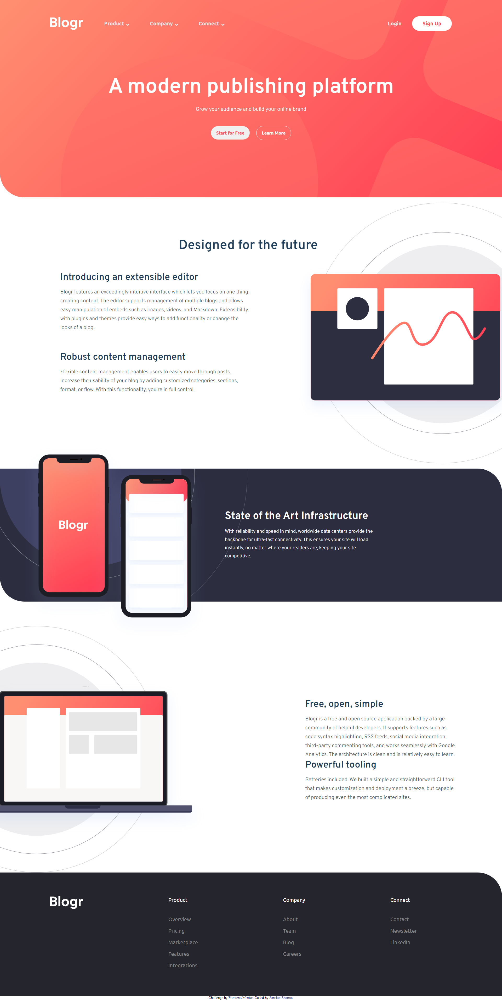
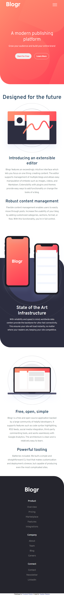

# Blogr-landing-page

This is a solution to the [Blogr landing page challenge on Frontend Mentor](https://www.frontendmentor.io/challenges/blogr-landing-page-EX2RLAApP). Frontend Mentor challenges help you improve your coding skills by building realistic projects. 

## Table of contents

- [Overview](#overview)
  - [Screenshot](#screenshot)
  - [Links](#links)
- [My process](#my-process)
  - [Built with](#built-with)

## Overview

### Screenshot

### Links

- Solution URL: [Solution](https://www.frontendmentor.io/solutions/blogr-landing-page-using-html-css-TwF_eq3Wsf)
- Live Site URL: [Live Site](https://sanskarsharma100.github.io/Blogr-landing-page/)

## My process

### Built with

- Semantic HTML5 markup
- CSS custom properties
- CSS Flex
- JavaScipt
